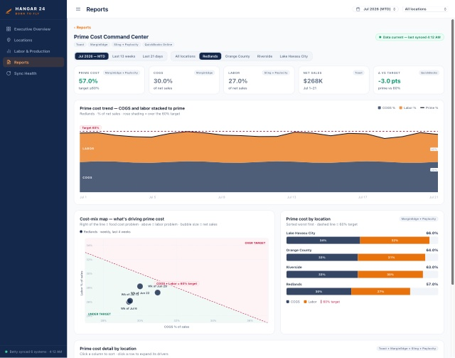

# Betty — Hangar 24 Ops

Front-end prototype of **Betty**, the operations dashboard for Hangar 24. This build covers the **app shell** (navigation, notifications, sync status) and the **Executive Overview**, including the Prime Cost Command Center, labor, brewery production, and per-location views.

> ⚠️ **Prototype only.** This is a front-end prototype with **hard-coded data** — there are no live integrations yet. It's intended for walking the team through the concept and UI. Real data connections (MarginEdge, Paylocity, etc.) and full functionality come next.

## Viewing it

The prototype is a single self-contained page. `support.js` pulls React and Babel from a CDN at runtime, so an internet connection is required.

1. Clone the repo.
2. Open `Hangar 24 Ops.dc.html` in a browser (or serve the folder, e.g. `python3 -m http.server`, and open the file).

`Hangar 24 Ops.dc.html` and `support.js` must stay in the same folder — the HTML loads the runtime via a relative path.

## Deploying (Railway / any Node host)

The repo is set up to deploy as a static site:

- `npm install` — installs [`serve`](https://www.npmjs.com/package/serve).
- `npm start` — serves the folder on `$PORT` (Railway sets this automatically; defaults to `3000` locally).
- `index.html` at the root redirects to the prototype, so the deployed URL just works.

No build step and no database are required for this prototype — it's front-end only.

## Files

| File | Purpose |
|------|---------|
| `Hangar 24 Ops.dc.html` | The prototype (built with Claude Design). Markup, styles, and hard-coded data. |
| `support.js` | Claude Design runtime that renders the `<x-dc>` template. |
| `index.html` | Root redirect to the prototype (so `/` loads it when deployed). |
| `admin/index.html` | Traffic dashboard at **`/admin`** — intentionally unlinked from the app; reach it by typing the URL. Simulated data for now. |
| `package.json` | Static-serve setup for deployment. |
| `preview.jpg` | Screenshot used in this README. |

## Admin traffic page (`/admin`)

A standalone traffic dashboard lives at `/admin` (KPIs, a 30-day visits trend, **visitors by city**, top pages, device/source/region splits). It is **not linked anywhere in the app** — it's only reachable by typing the URL. The figures are simulated; in production, visits would be logged to the Postgres warehouse on Railway with city/region resolved from visitor IP via geo-IP lookup.

## Roadmap

- [ ] Wire up live data integrations (MarginEdge, Paylocity, POS)
- [ ] Replace hard-coded values with real metrics
- [ ] Build out remaining sections beyond the shell + Executive Overview
